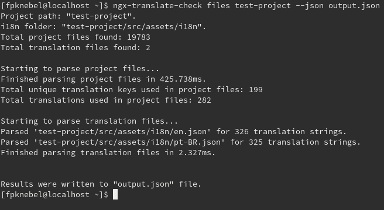
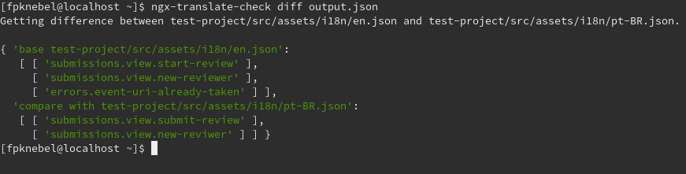

# ngx-translate-check
CLI to test an Angular project using ng-translate to find missing and unused i18n strings.

[](https://github.com/FranciscoKnebel/ngx-translate-check/issues)

## Prerequisites
- Node & NPM


### Installing

```
  $ npm install -g ngx-translate-check
```

### Commands

* files: Parses project files and i18n files to find amount of usage of i18n strings, outputting to stdout or a json file.
  * Output exports a JSON file, in the format below.
  * The `input` key shows all i18n strings found in your project .ts, .js and .html files, the amount of times they were found and in which files.
  * The `translations` key shows all the translation strings defined in each translation file.
  ```
  "files-output.json"
  {
    "input": {
      "string1": {
        "amount": 1,
        "files": [ "src/test1.html" ]
      },
      "string2": {
        "amount": 2,
        "files": [ "src/test1.html", "src/test2.html" ]
      },
    },
    "translations": {
      "path/to/translation/en.json": {
        "string1": 1,
        "string2": 1,
        "string3": 1
      },
      "path/to/translation/pt-BR.json": {
        "string1": 1,
        "string2": 1,
        "string4": 1
      },
      ...
    }
  }
  ```

* diff: Receives a JSON file generated by the `files` command and shows difference between translation files (missing strings between files).

* diff-input: Receives a JSON file generated by the `files` command and shows difference between translation and input files (strings in input files but not in translations, strings in translations but not in input files).

More info can be obtained by using the `--help` argument of the CLI.

#### Example command usage:


- Wrote to `output.json` the data obtained from test-project, which includes all strings used in the project and all the strings defined in the translation files.


- Used `output.json` from the `files` command to obtain the difference between the defined translation files.

### TO-DO List

#### More commands

- [ ] Difference between translation and project files.

- [ ] Improve project file parser to obtain missing strings that the current regex does not catch.

## Versioning

We use [SemVer](http://semver.org/) for versioning. For the versions available, see the [tags on this repository](https://github.com/FranciscoKnebel/ngx-translate-check/tags).


## Authors

Initial project implementation by [Francisco Knebel](https://github.com/franciscoknebel).

Project idea credits to [Arthur Jacobs](https://github.com/asjacobs92), who suffered along with Angular development, while we survived reading broken JSON files due to a missing comma.

See the full list of [contributors](https://github.com/FranciscoKnebel/ngx-translate-check/contributors) who participated in this project.

## License
MIT License. [Click here for more information.](LICENSE.md)

